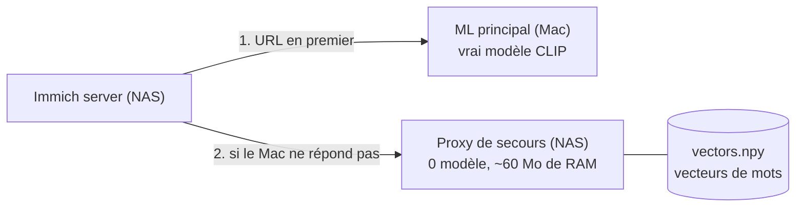

# immich-ml-fallback

Proxy ML **de secours** pour [Immich](https://immich.app) : garde la **recherche intelligente (texte)** qui marche quand ton serveur ML principal (par ex. un Mac qui n'est pas allumé 24h/24) est éteint, **sans charger aucun modèle** sur le NAS.



## Comment ça marche

Le text encoder CLIP est trop lourd pour un petit NAS. Mais une requête de recherche est courte : on **précalcule sur le Mac** le vecteur de chaque mot (et de quelques expressions comme « coucher de soleil »), et le proxy fait juste : découper la requête → ignorer les mots vides et les mots inconnus → **sommer** les vecteurs → **normaliser**.

- Les vecteurs sont obtenus en interrogeant **le vrai serveur ML d'Immich** (même modèle, même tokenizer, même nettoyage de texte que pour une vraie recherche). Aucune ré-implémentation de CLIP, donc pas de risque de vecteurs incomparables.
- Le proxy imite uniquement ce que la recherche texte utilise : `GET /ping` et `POST /predict` (entrée `clip` / `textual`). Tout le reste (encodage d'images, visages, OCR) répond une **erreur explicite (501)** pour qu'Immich passe au serveur suivant au lieu de recevoir une mauvaise réponse.
- Si le modèle CLIP d'Immich ne correspond pas à celui des vecteurs : erreur 409 (jamais de résultats faux en silence).

> ⚠️ C'est une **approximation**. Un vrai text encoder comprend l'ordre des mots et le contexte ; ici c'est un « sac de mots » (+ expressions). Bien pour « plage », « chien neige », « gâteau anniversaire » ; moins pour les requêtes subtiles. Voir [Qualité](#qualité-et-limites).

## Prérequis

- Un serveur ML Immich qui tourne sur le Mac et que tu peux joindre (ex. `http://localhost:3003`).
- Python ≥ 3.10 sur le Mac.
- Docker sur le NAS (image **amd64 et arm64**).
- Immich récent : le format a été relevé dans le code d'**Immich v3.2.4** (détails : [docs/immich-protocol.md](docs/immich-protocol.md)).
- Le **nom exact du modèle CLIP** : Immich → Administration → Paramètres → *Paramètres d'apprentissage automatique* → *Modèle de langage CLIP* (ex. `ViT-SO400M-16-SigLIP2-384__webli`). Il faut un modèle **multilingue** pour chercher en français (les SigLIP2 `__webli` le sont).

## 1. Générer les vecteurs (sur le Mac)

```bash
git clone https://github.com/<ton-user-github>/immich-ml-fallback.git
cd immich-ml-fallback
python3 -m venv .venv && source .venv/bin/activate
pip install -e ".[generate]"

# Le serveur ML du Mac doit être allumé. Test rapide (200 mots) :
python -m immich_ml_fallback generate \
  --ml-url http://localhost:3003 \
  --model ViT-SO400M-16-SigLIP2-384__webli \
  --data data --limit 200

# Génération complète (reprend là où elle s'est arrêtée si tu l'interromps) :
python -m immich_ml_fallback generate \
  --ml-url http://localhost:3003 \
  --model ViT-SO400M-16-SigLIP2-384__webli \
  --data data
```

Par défaut : les 10 000 mots les plus fréquents en français et en anglais (liste `wordfreq`), sans les mots vides, plus ~140 expressions et ~200 mots « photo » fournis dans le dépôt → environ **17 800 entrées**. Avec un modèle à 1152 dimensions (SigLIP2 SO400M) en float16, ça pèse **≈ 41 Mo** (≈ 2,3 Ko par entrée ; ta règle « ~2 Ko par vecteur » vaut pour float16, pas pour float32).

Options utiles :

| Option | Rôle |
|---|---|
| `--extra-words mes_mots.txt` | tes propres mots/expressions (1 par ligne, `#` = commentaire). Répétable. |
| `--top-n 20000` | plus de mots par langue (`0` = seulement les listes du dépôt) |
| `--languages fr en de` | autres langues (codes `wordfreq`) |
| `--workers 4` | requêtes en parallèle vers le serveur ML |
| `--rebuild` | repartir de zéro (obligatoire si tu changes de modèle CLIP) |
| `--dry-run` | compter le vocabulaire sans rien encoder |

La génération est **incrémentale** : relancer la commande n'encode que les entrées manquantes. Compte plusieurs minutes (une requête ML par entrée ; la première peut être lente le temps que le modèle se charge).

Résultat dans `data/` : `vectors.npy` + `index.json`. Ne les committe pas (déjà dans `.gitignore`).

### Mesurer la qualité

```bash
python -m immich_ml_fallback evaluate \
  --ml-url http://localhost:3003 --model ViT-SO400M-16-SigLIP2-384__webli --data data
```

Pour ~50 requêtes FR/EN (ou `--queries mon_fichier.txt`), affiche la **similarité cosinus** entre le vrai embedding et l'approximation du proxy (1 = identique), les pires en premier, avec les mots utilisés / inconnus. Les requêtes mal notées sont celles où ajouter une expression dans `--extra-words` aide le plus. Pour voir comment une requête est découpée sans serveur : `python -m immich_ml_fallback explain --data data "chien dans la neige"`.

## 2. Copier les vecteurs sur le NAS

```bash
ssh <user>@<ip-du-nas> "mkdir -p /volume1/docker/immich-ml-fallback/data"
scp data/vectors.npy data/index.json <user>@<ip-du-nas>:/volume1/docker/immich-ml-fallback/data/
```

(Si `scp` échoue avec « sftp-server: not found », ajoute `-O`.) Le proxy **recharge tout seul** les fichiers quand ils changent : pas de redémarrage après une mise à jour des vecteurs.

## 3. Lancer le proxy sur le NAS (Docker)

### Option A — image prête depuis GitHub (recommandé, rien à compiler sur le NAS)

Le workflow `.github/workflows/docker.yml` construit l'image (amd64 + arm64) et la publie sur `ghcr.io/<ton-user-github>/immich-ml-fallback` à chaque push sur `main`.

```bash
cd /volume1/docker/immich-ml-fallback
curl -fsSLO https://raw.githubusercontent.com/<ton-user-github>/immich-ml-fallback/main/docker-compose.ghcr.yml
sed -i 's/OWNER/<ton-user-github-en-minuscules>/' docker-compose.ghcr.yml
docker compose -f docker-compose.ghcr.yml up -d
```

Si `docker pull` demande un login : GitHub → ton profil → *Packages* → le paquet → *Package settings* → visibilité **Public**.

### Option B — compiler sur le NAS depuis GitHub

```bash
cd /volume1/docker
git clone https://github.com/<ton-user-github>/immich-ml-fallback.git
cd immich-ml-fallback
echo "DATA_PATH=/volume1/docker/immich-ml-fallback/data" > .env   # dossier où tu as copié les vecteurs (étape 2)
docker compose up -d --build
```

(Pas de `git` sur le NAS ? Utilise l'option A, ou télécharge le zip du dépôt depuis GitHub.)

### Vérifier

```bash
curl http://<ip-du-nas>:3003/ping          # pong
curl http://<ip-du-nas>:3003/info          # modèle, dimension, nombre d'entrées
curl "http://<ip-du-nas>:3003/explain?q=chien%20dans%20la%20neige"
curl -s -X POST http://<ip-du-nas>:3003/predict \
  -F 'entries={"clip":{"textual":{"modelName":"ViT-SO400M-16-SigLIP2-384__webli","options":{}}}}' \
  -F 'text=plage' | head -c 150
docker logs -f immich-ml-fallback          # chaque requête : mots utilisés / ignorés / inconnus
```

Variables d'environnement : `PORT` (3003), `LOG_LEVEL`, `DATA_DIR` (`/data` dans l'image). Le fichier optionnel `data/stopwords.txt` ajoute tes propres mots vides (1 par ligne).

## 4. Configurer Immich

Administration → Paramètres → **Paramètres d'apprentissage automatique** → URL du serveur : ajoute le proxy **en dernier**.

1. `http://<ip-du-mac-ou-tailscale>:3003` (serveur ML principal)
2. `http://<ip-du-nas>:3003`, ou `http://immich-ml-fallback:3003` si le proxy est sur le même réseau Docker qu'Immich (service ajouté à son `docker-compose.yml`, ou réseau externe partagé).

Laisse activées les **Vérifications de disponibilité** (réglages par défaut : requête `/ping` toutes les 30 s, délai 2 s). Comportement lu dans le code d'Immich (`machine-learning.repository.ts`) : les serveurs jugés disponibles sont essayés en premier, les autres ensuite, et toute réponse non-2xx marque l'URL « indisponible » jusqu'à la prochaine vérification. Donc, Mac allumé → le Mac répond ; Mac éteint → le proxy prend la recherche texte.

⚠️ Conséquence à connaître : pendant que le Mac est éteint, les **jobs d'indexation** (encodage des nouvelles photos, visages, OCR) frappent aussi le proxy, qui les refuse (501, c'est voulu). Ce refus marque le proxy « indisponible » jusqu'au prochain `/ping` ; une recherche lancée dans cet intervalle essaie d'abord le Mac (injoignable) avant de retomber sur le proxy, avec une attente possible. Pour l'éviter : mets en pause ces jobs dans Immich (Administration → Tâches) quand le Mac est éteint, ou baisse l'*Intervalle de vérification*. *(Déduit du code, à confirmer en pratique.)*

Autre détail : Immich garde en cache les 100 dernières requêtes → une requête servie par le proxy garde son embedding approximatif jusqu'au redémarrage d'Immich, même si le Mac revient.

## 5. Tester « Mac éteint »

1. Éteins le serveur ML du Mac (ou le conteneur : `docker stop immich-machine-learning` sur le Mac).
2. Attends ~30 s, puis lance une recherche intelligente dans Immich (`plage`, `chien neige`…).
3. `docker logs immich-ml-fallback` doit montrer la requête.

## Qualité et limites

- Approximation « sac de mots » : pas d'ordre, pas de négation (« sans »), pas de relations (« chien à gauche du chat »). Les expressions du dépôt (`resources/phrases_*.txt`) sont encodées en entier, donc « coucher de soleil » ≠ « coucher » + « soleil ».
- Les mots hors vocabulaire sont ignorés. Pluriels simples et accents manquants sont tolérés (`foret` → `forêt`, `chevaux` → `cheval`). Si **aucun** mot n'est connu : erreur 422 explicite.
- Les chiffres sont ignorés.
- Ne sert **que** la recherche texte. Les nouvelles photos ne sont pas indexées sans le vrai ML.
- Pas d'authentification (comme le serveur ML d'Immich) : ne l'expose pas sur Internet ; garde-le sur le LAN / Tailscale.

## État du projet

Vérifié : protocole contre le code d'Immich v3.2.4, avec un client Node (`fetch` + `FormData`, comme le serveur Immich) ; chaîne complète générer → stocker → servir avec un faux serveur ML ; 37 tests (`pip install -e ".[dev]" && python -m pytest`). **À faire de ton côté** : la première génération sur le vrai modèle SigLIP2 et `evaluate` (c'est ce qui dit si la qualité te convient), et le build Docker (non exécuté dans l'environnement où le code a été écrit).

## Dépannage

| Symptôme | Cause probable |
|---|---|
| `/ping` → 503, conteneur « unhealthy » | pas de `vectors.npy` + `index.json` dans le dossier monté (`docker logs` donne la raison) |
| Immich : `failed with status 409` | modèle CLIP d'Immich ≠ modèle des vecteurs → régénère avec `--rebuild` |
| Immich : `failed with status 501` | normal : une tâche autre que la recherche texte (image, visages, OCR) |
| La recherche affiche une erreur (422) | aucun mot de la requête n'est connu → `curl .../explain?q=...`, ajoute le mot avec `--extra-words` |
| `generate` : `Dimension changed` | le serveur ML a changé de modèle pendant la génération → `--rebuild` |
| Résultats trop approximatifs | lance `evaluate`, ajoute les expressions manquantes, régénère (incrémental) |

## Développement

```bash
pip install -e ".[dev]"
python -m pytest
```

Licence : MIT.
